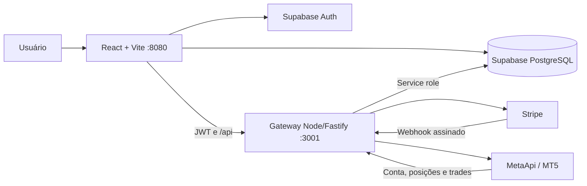

# Arquitetura do Fortify

## Visão geral



O frontend é uma SPA React. Autenticação e consultas permitidas por RLS usam Supabase. Operações com segredo, custo ou privilégio passam pelo gateway em `services/metaapi-gateway/src/server.ts`. Em desenvolvimento, o Vite encaminha `/api` para `http://localhost:3001`.

## Responsabilidades

### Frontend

- Rotas e proteção de sessão em `src/App.tsx`.
- Layout e navegação em `src/components/AppLayout.tsx` e `AppSidebar.tsx`.
- Telas em `src/pages/`.
- Chamadas de billing em `src/lib/billing.ts`.
- Chamadas e consultas MT5 em hooks/páginas, sempre autenticadas.
- Cálculos locais da calculadora em `src/lib/riskCalculator.ts`.
- TradingView incorporado em `src/components/tradingview/`.

O frontend não decide sozinho se uma assinatura autoriza MetaApi. Ele pode esconder ações por UX, mas a decisão final pertence ao gateway.

### Gateway

- Valida JWT Supabase nos endpoints protegidos.
- Usa a service role somente no servidor.
- Cria Checkout e Customer Portal.
- Verifica assinatura de webhook e sincroniza assinatura.
- Calcula entitlement e limite de contas.
- Provisiona, sincroniza, suspende e reativa MetaApi.
- Protege rotas ADM e o reconciliador interno.
- Aplica rate limit e sanitiza identificadores em logs.

### Supabase

- Auth e sessão do usuário.
- Persistência de planos, assinaturas, perfis e contas.
- Dados MT5 sincronizados: snapshots, posições e trades.
- Catálogo versionado de mesas e regras.
- RLS para isolamento entre usuários.

## Fluxo de checkout

1. Usuário autenticado escolhe um `planSlug` em `/pricing`.
2. `src/lib/billing.ts` confirma que o gateway responde em `/health`.
3. Frontend chama `POST /billing/create-checkout-session` com JWT.
4. Gateway valida plano ativo e um `stripe_price_id` iniciado por `price_`.
5. Gateway cria/reutiliza Customer e cria Checkout em modo assinatura.
6. Frontend só aceita URL contendo `checkout.stripe.com`.
7. Após pagamento, Stripe envia webhook e redireciona para o Dashboard com `session_id`.
8. Webhook e `POST /billing/confirm-checkout-session` convergem para atualizar `user_subscriptions`.

## Fluxo de conexão MT5

1. Frontend envia credenciais para `POST /metaapi/connect` com JWT.
2. Gateway identifica o usuário e chama `getUserEntitlement` antes do provisionamento.
3. O entitlement exige plano pago, status válido, período futuro e limite disponível.
4. Gateway cria ou reutiliza a conta no MetaApi e acompanha deploy/conexão.
5. Registra `mt5_connections` e vincula a `trading_accounts`.
6. Credenciais sensíveis não são devolvidas nem registradas em logs.

## Fluxo de sincronização

1. Frontend chama `POST /metaapi/sync` com JWT e identificador válido.
2. Gateway valida propriedade da conexão e entitlement.
3. Se o entitlement for inválido, aciona suspensão e responde sem consultar dados pagos.
4. Se válido, garante a disponibilidade da conta MetaApi.
5. Atualiza conta, snapshots, posições e trades no Supabase.
6. Avaliações de regras usam os dados sincronizados.

## Cancelamento ou falha de pagamento

1. Stripe envia atualização de assinatura ou falha de fatura.
2. Gateway verifica `Stripe-Signature` sobre o corpo bruto.
3. Status e datas são persistidos em `user_subscriptions`.
4. `getUserEntitlement` deixa de autorizar quando status/período são inválidos.
5. `suspendUserMetaApiAccounts` tenta undeploy sem apagar dados.
6. Falha de undeploy deixa a conta como `suspension_pending` para nova tentativa.
7. `POST /internal/billing/reconcile-subscriptions` corrige divergências sob segredo interno.

## Dependências críticas

| Área | Depende de | Falha esperada quando indisponível |
| --- | --- | --- |
| Login e RLS | Supabase | Sessão/consultas indisponíveis. |
| Compra e portal | Stripe + gateway | Checkout/portal indisponível; app não deve simular pagamento. |
| Conexão e sync | MetaApi + gateway + entitlement | Conta não conecta/sincroniza; não inventar dados. |
| Dashboard | Supabase e dados sincronizados | Exibir estado vazio ou sync atrasado. |
| TradingView | Widget incorporado | Gráfico indisponível sem afetar conta ou cobrança. |

## Como validar após uma mudança arquitetural

```powershell
npm run build
npx tsc --noEmit --project services/metaapi-gateway/tsconfig.json
```

Para fluxo local completo, use `npm run dev` e teste frontend e `/health`. Mudanças em webhook ou MetaApi exigem testes específicos dos respectivos manuais.
