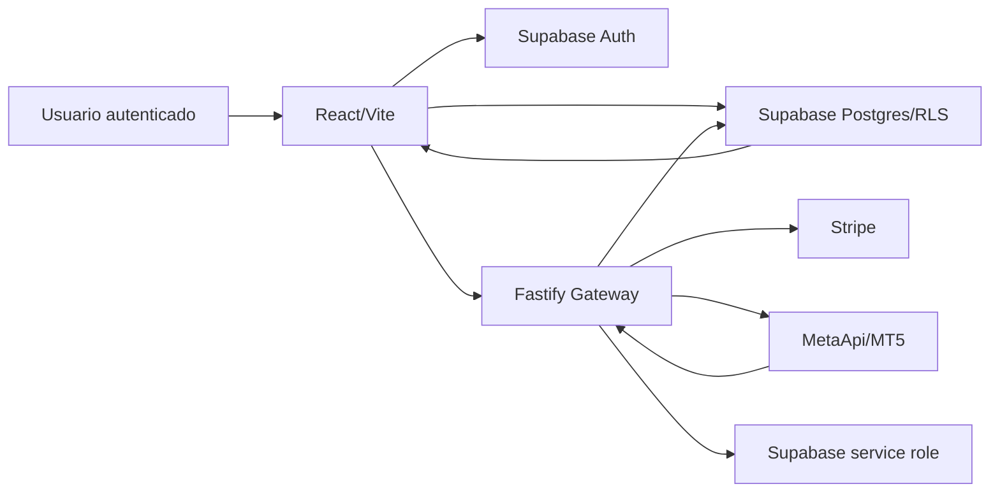

# Contexto e Arquitetura do Fortify

## Produto

Fortify e uma central de comando de risco para traders de prop firms que usam MT5.

O MVP deve ajudar o trader a:

- conectar contas MT5 com seguranca;
- sincronizar saldo, equity, posicoes e trades;
- aplicar regras de prop firm;
- enxergar violacoes, alertas e risco operacional;
- controlar acesso por assinatura paga;
- evitar custo MetaApi para usuarios sem plano ativo.

Fortify nao executa ordens. Fortify monitora, calcula, alerta e organiza regras.

## Stack real

| Camada | Tecnologia atual | Onde fica |
| --- | --- | --- |
| App web | Vite + React + TypeScript | `src/` |
| Rotas | React Router | `src/App.tsx` |
| UI | Tailwind, shadcn/ui, lucide-react | `src/components`, `src/pages` |
| Estado remoto | React Query + Supabase client | `src/hooks`, `src/integrations/supabase` |
| Auth | Supabase Auth | `src/hooks/useAuth.ts`, Supabase |
| Banco | Supabase Postgres + RLS | `supabase/migrations` |
| Gateway | Fastify + tsx | `services/metaapi-gateway/src/server.ts` |
| MT5/MetaApi | MetaApi API via gateway | `/metaapi/connect`, `/metaapi/sync` |
| Billing | Stripe via gateway | `/billing/*`, `/internal/billing/*` |
| Regras | SQL + avaliador no gateway | `rule_definitions`, `rule_instances`, `rule_evaluations` |

Nao assumir NestJS, Next.js ou Prisma neste projeto.

## Comando local padrao

```sh
npm run dev
```

Esse comando deve subir:

- frontend em `http://localhost:8080`;
- gateway em `http://localhost:3001`;
- proxy `/api` do Vite para o gateway.

Comandos auxiliares:

```sh
npm run dev:app       # somente Vite
npm run dev:gateway   # somente gateway Fastify
npm run dev:all       # alias do stack completo
```

## Fluxo de dados principal



## Tabelas centrais

| Area | Tabelas principais |
| --- | --- |
| Contas | `trading_accounts`, `mt5_connections` |
| MT5 | `mt5_positions`, `mt5_trades`, `mt5_account_snapshots` |
| Regras | `prop_firms`, `programs`, `rule_set_versions`, `rule_definitions`, `rule_instances`, `rule_evaluations` |
| Billing | `plans`, `user_subscriptions`, `subscription_addons` |
| Perfil | `user_profiles` |

## Ponto critico: billing controla MetaApi

Regra de negocio:

- assinatura paga ativa + `paid_until` futuro = MetaApi permitido;
- sem plano, beta free, vencido, cancelado, `past_due`, `unpaid`, `incomplete` ou falha de pagamento = bloquear connect/sync e suspender contas quando aplicavel.

Essa logica vive no gateway, principalmente em:

- `getUserEntitlement`;
- `/metaapi/connect`;
- `/metaapi/sync`;
- `suspendUserMetaApiAccounts`;
- `/internal/billing/reconcile-subscriptions`.

Nao mover essa regra para o frontend. O frontend pode explicar o bloqueio, mas a protecao real precisa continuar no backend.

## Ponto critico: secrets

Nunca colocar em codigo, docs, migrations, logs ou report:

- Stripe secret key;
- Stripe webhook secret;
- Supabase service role;
- MetaApi token;
- senha MT5;
- chaves de API.

`.env` local nunca deve ser commitado.

## Areas de produto ja existentes

| Area | Arquivos relevantes |
| --- | --- |
| Dashboard/Painel | `src/pages/Dashboard.tsx` |
| Pricing/Billing UI | `src/pages/PricingPage.tsx`, `src/lib/billing.ts` |
| Configuracoes | `src/pages/SettingsPage.tsx` |
| MT5 | `src/pages/MT5Connections.tsx`, `src/pages/MT5Dashboard.tsx`, `src/hooks/useMT5.ts` |
| Biblioteca de Mesas | `src/pages/PropFirmLibrary.tsx`, `src/hooks/usePropFirmLibrary.ts` |
| Extrator de regras | `src/components/RuleExtractor.tsx`, `supabase/functions/extract-rules/index.ts` |
| Calculadora de risco | `src/pages/RiskCalculator.tsx`, `src/lib/riskCalculator.ts` |
| Admin | `src/pages/Admin.tsx`, rotas `/admin/*` no gateway |

